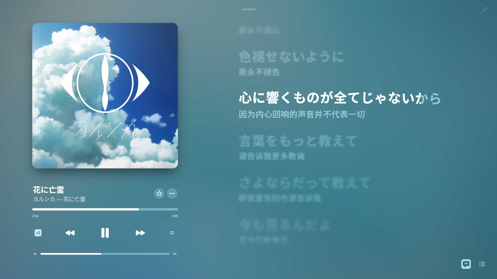
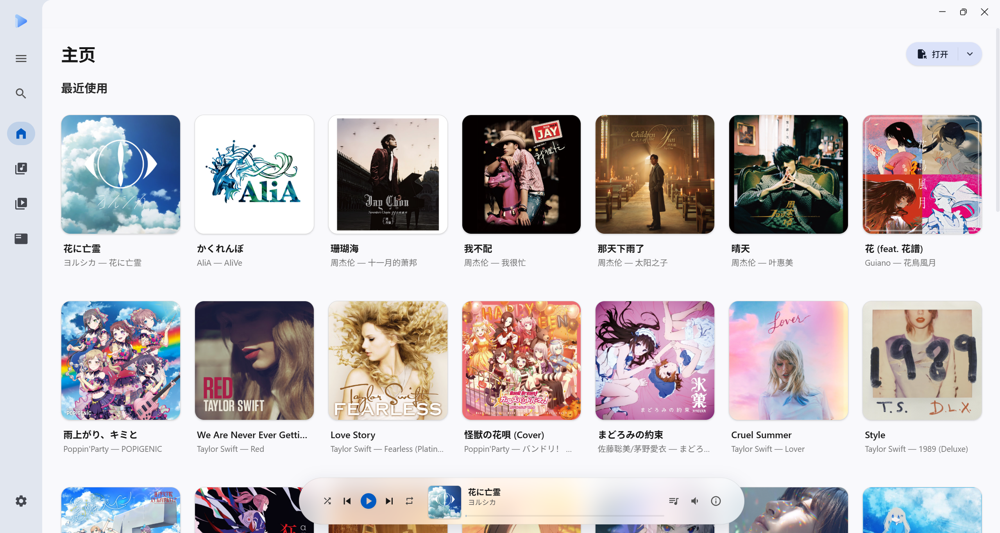
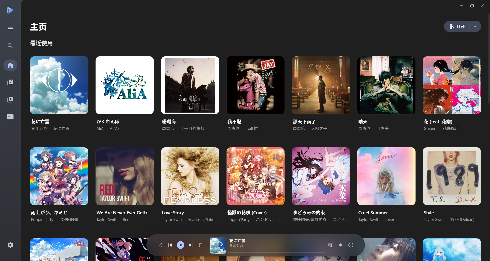
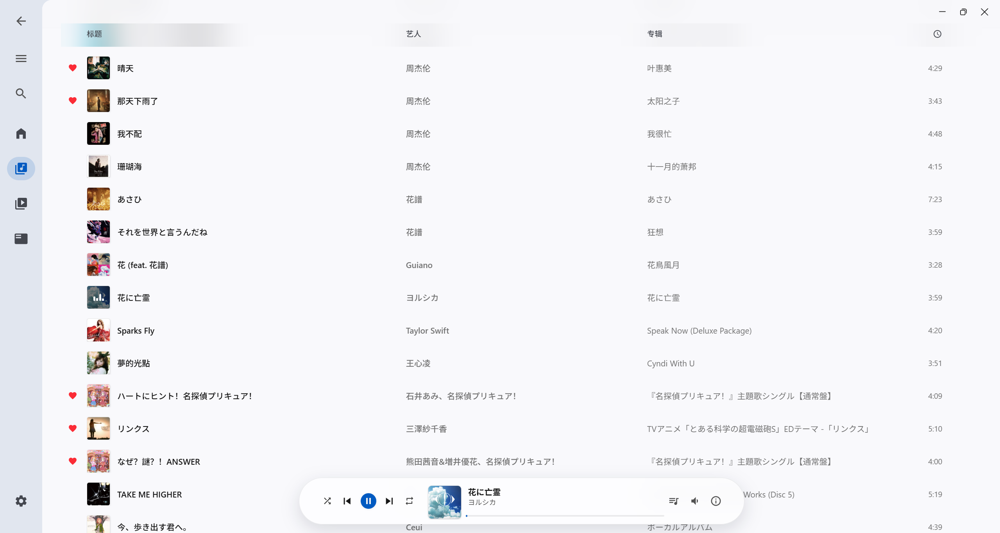
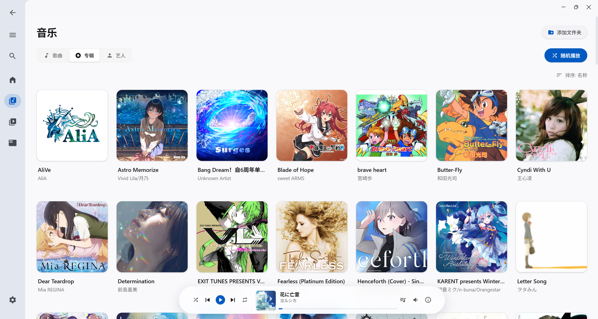
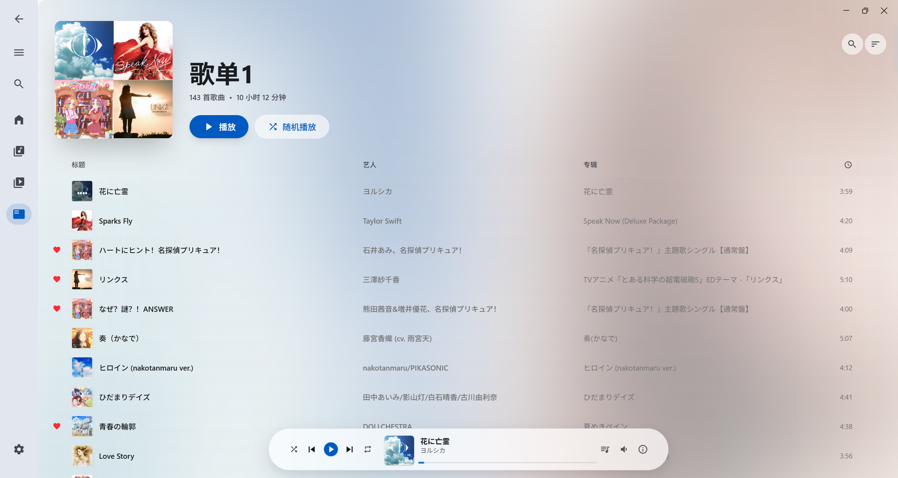
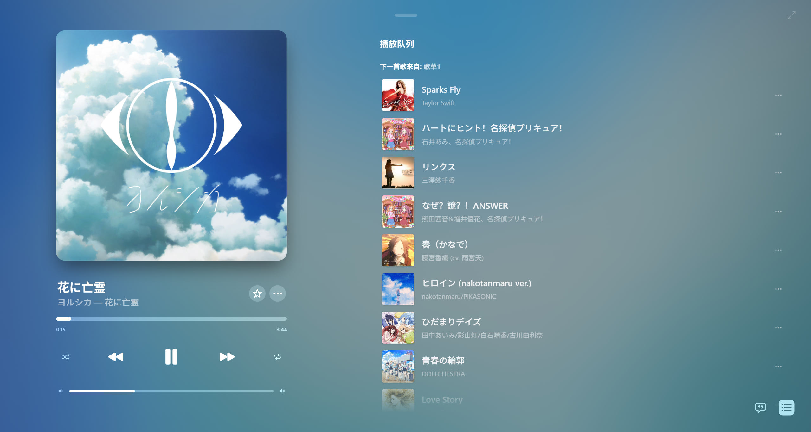
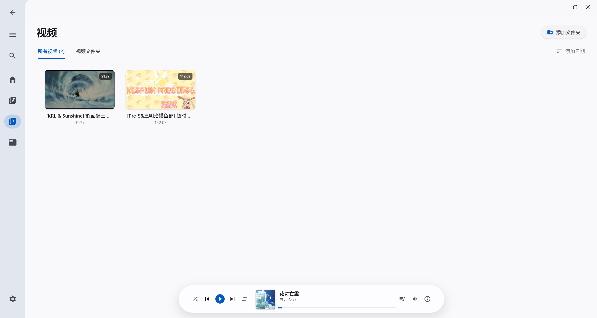

<div align="center">
  
  <h1>Simple Player</h1>
  <p>轻量级的本地音乐与视频播放器</p>
  <p>
    
    <a href="LICENSE"></a>
    
  </p>
  <p>
    <a href="https://github.com/Jimie165/simple-player/releases">下载</a> ·
    <a href="#界面预览">界面预览</a> ·
    <a href="docs/TROUBLESHOOTING.md">常见问题</a> ·
    <a href="https://github.com/Jimie165/simple-player/issues">问题反馈</a>
  </p>
</div>

Simple Player 是一款本地音乐与视频播放器。添加文件夹即可浏览和播放本地媒体，支持按歌曲、艺人和专辑管理音乐库，也可以创建歌单、收藏喜欢的歌曲。播放时还能打开沉浸式界面，搭配动态背景与逐字歌词。

> **macOS 版本仍在开发中**：目前仅通过 [GitHub Actions](https://github.com/Jimie165/simple-player/actions/workflows/macos.yml) 下载测试构建，提供 Intel 和 Apple Silicon 的应用 ZIP 与 DMG。macOS 正式版本将在完成全面适配后发布，获取方式见 [macOS 适配与测试](docs/MACOS.md)。

## 界面预览

### 沉浸式播放



### 浅色与深色主题

<table>
  <tr>
    <th width="50%">浅色主页</th>
    <th width="50%">深色主页</th>
  </tr>
  <tr>
    <td></td>
    <td></td>
  </tr>
</table>

### 竖屏布局

<table>
  <tr>
    <th width="50%">主页</th>
    <th width="50%">沉浸式播放</th>
  </tr>
  <tr>
    <td align="center"></td>
    <td align="center"></td>
  </tr>
</table>

<details>
<summary>查看更多：音乐库、歌单、播放队列和视频库</summary>

<table>
  <tr>
    <th width="50%">歌曲列表</th>
    <th width="50%">专辑视图</th>
  </tr>
  <tr>
    <td></td>
    <td></td>
  </tr>
  <tr>
    <th>歌单</th>
    <th>播放队列</th>
  </tr>
  <tr>
    <td></td>
    <td></td>
  </tr>
</table>

<p><strong>视频库</strong></p>


</details>

## 核心特性

- **音乐库**：按歌曲、艺人或专辑浏览本地音乐，支持搜索、收藏、查看最近播放和编辑歌曲信息。
- **沉浸式播放**：支持普通歌词、滚动歌词和逐字歌词，搭配动态背景；缩窄窗口后，播放页也会随之调整布局。
- **歌单与播放队列**：为歌单设置名称、说明和封面，拖动调整播放顺序，或把想听的歌曲插入队列。关闭应用后，播放队列也会保留。
- **视频播放**：通过缩略图浏览本地视频。遇到不能直接播放的视频时，自动转换为兼容格式；转换产生的缓存可以在设置中管理。
- **外观设置**：选择浅色、深色或跟随系统的主题，也可以自定义主题颜色。
- **桌面体验**：通过 Windows 系统媒体控件或 macOS 控制中心控制播放，可以在设置中选择音频输出设备。

## 下载与使用

Windows 版本支持 Windows 10 / Windows 11；macOS 开发版本面向 macOS 12 及以上，提供 Intel 和 Apple Silicon 两种架构的测试构建。

在 [Releases](https://github.com/Jimie165/simple-player/releases) 页面下载 Windows 安装包（`.exe` 或 `.msi`），下载后运行即可安装。页面中的 `Source code` 是源码，不是安装包。如果还没有发布安装包，可以参考下方的开发说明自行构建。

Windows 运行 Simple Player 需要 WebView2。如果电脑上还没有安装，请先安装 WebView2 运行时。macOS 使用系统自带的 WKWebView，无需安装 WebView2。

macOS 测试包请从 [GitHub Actions](https://github.com/Jimie165/simple-player/actions/workflows/macos.yml) 中已成功完成的手动打包任务下载，并按设备架构选择对应产物。ZIP 在 macOS 内解压后可直接运行，DMG 打开后将应用拖入“应用程序”即可安装。当前测试包未做 Apple 公证，首次打开可能出现系统安全提示，详细步骤见 [macOS 适配与测试](docs/MACOS.md)。

首次使用：

1. 打开应用，在音乐库中点击“添加文件夹”，选择存放音乐的文件夹，也可以在设置中的“音乐文件夹”里添加。
2. 扫描完成后，音乐就会出现在音乐库中，选择歌曲即可播放。
3. 要添加视频，请到设置中的“视频文件夹”里选择存放视频的文件夹。
4. 你还可以创建歌单，或到设置中更换主题和音频输出设备。

## 使用说明

### 媒体格式

添加文件夹时，应用会扫描以下扩展名的文件：

| 类型 | 扩展名 |
| --- | --- |
| 音频 | `mp3`、`flac`、`wav`、`ogg`、`m4a` |
| 视频 | `mp4`、`mkv`、`avi`、`mov`、`webm`、`flv`、`m4v`、`3gp`、`ts`、`rmvb`、`wmv`、`asf`、`ogv` |

有些视频虽然能出现在视频库中，但系统 WebView 无法直接播放。遇到这种情况，应用会通过重封装或转码将其转换为兼容的 MP4 文件，第一次播放时可能需要等待一段时间。你可以在设置中更改转码缓存的位置和容量上限。

### 检查更新

应用默认在启动时检查更新，也可以在设置中的“关于”里手动检查或关闭自动检查。发现新版本后，点击“前往下载”，到发布页面下载并安装新版本。

更新检查针对 Releases 正式发布版本；macOS 开发构建目前仍需从 GitHub Actions 下载。

### 数据与常见问题

音乐库、视频库、歌单和播放队列的数据都保存在电脑上。添加文件夹不会移动或复制原来的音乐和视频文件；应用会另外缓存封面、视频缩略图和转换后的视频。具体存储位置见 [开发文档](docs/DEVELOPMENT.md#数据与缓存)。

如果遇到扫描、播放或视频转换问题，可以先查看 [故障排查](docs/TROUBLESHOOTING.md)。

## 开发与构建

从源码运行或构建应用，需要安装 Node.js、pnpm 和 Rust stable。当前 CI 使用 Node.js 24、pnpm 11.11.0 和 Rust 1.98.1。

Windows 需要 MSVC 工具链和 WebView2；macOS 需要 Xcode Command Line Tools。macOS 本地构建与 GitHub Actions 测试包的获取步骤见 [macOS 适配与测试](docs/MACOS.md)。

运行或打包前，请准备好 FFmpeg 和 FFprobe 可执行文件，按 [sidecar 说明](backend/tauri/binaries/README.md) 命名并放入指定目录。打包时，文件名必须包含目标平台的 target triple。

```shell
# 安装依赖
pnpm install

# 启动桌面开发模式
pnpm dev

# 构建当前平台的应用包
pnpm build
```

环境配置、项目结构、检查命令和版本更新方法见 [开发文档](docs/DEVELOPMENT.md)。

## 反馈与贡献

遇到问题或有功能建议，欢迎提交 [Issue](https://github.com/Jimie165/simple-player/issues)。如果想参与开发，也欢迎提交 Pull Request。

反馈问题时，请附上应用版本、操作系统版本和设备架构（如 Intel 或 Apple Silicon），说明进行了哪些操作、出现了什么问题，最好能提供截图或错误信息。如果是文件扫描或播放问题，也请注明文件格式。上传日志和截图前，记得遮盖个人路径等隐私信息。

提交代码前，请阅读 [开发文档](docs/DEVELOPMENT.md)，并根据修改内容运行相应的检查。

## 致谢

Simple Player 的开发离不开 Tauri、React、Vite、Zustand、Tailwind CSS、SQLite、rodio、cpal、symphonia 和 FFmpeg 等开源项目，感谢这些项目的开发者和贡献者。

完整依赖列表见 [前端配置](frontend/package.json) 和 [Rust 配置](backend/tauri/Cargo.toml)。各依赖遵循各自的许可证。

## 许可证

本项目采用 [GNU General Public License v3.0](LICENSE) 开源。

安装包中包含 FFmpeg 和 FFprobe。分发应用或替换这些文件时，请同时遵守所用 FFmpeg 版本的 LGPL/GPL 许可要求。
